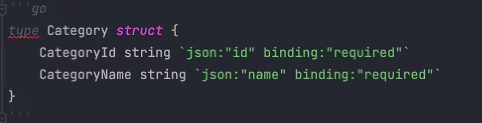
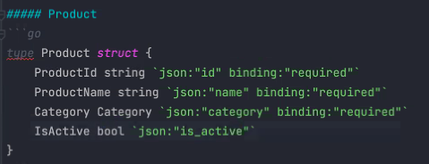
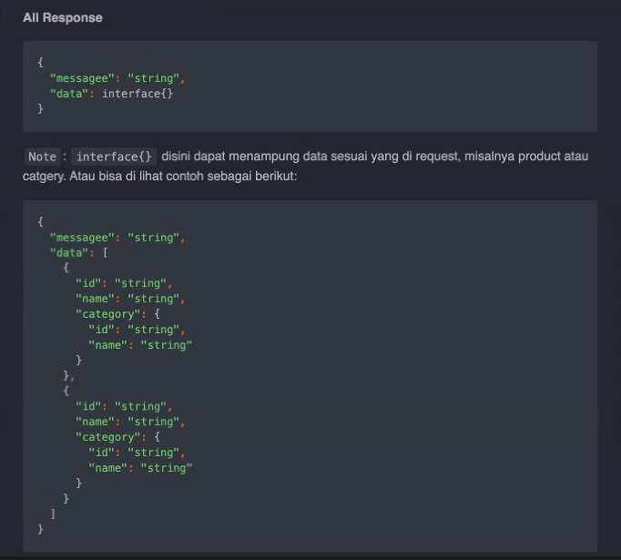

### PRACTICE API

### SOAL

Buatlah sebuah API untuk CRUD 

### Model 

## Category

## Storage 

## Storage 
Penyimpanan sementara hanya di slice

## Method 
1. Post product
2. Get Product (Params: id)
3. Get Product By Category (List)
4. Put category
5. Delete Product (dengan melakuakn update is_active)

